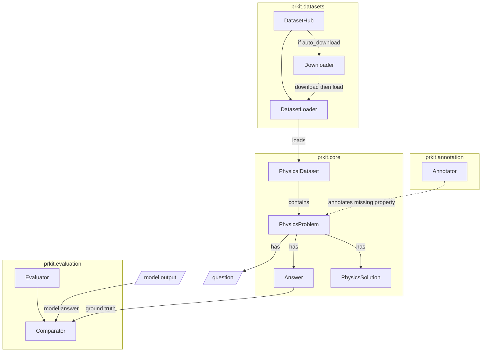

# PRKit Core — Physics & Physical Reasoning Domain Model

This document describes the core abstractions of the physical-reasoning-toolkit. **Core components** define the physics ontology (domain, answers, problems, datasets, solutions) and are used across all PRKit packages. **Utility components** provide supporting infrastructure.

---

## Core Components

### PhysicsDomain

Enumeration of physics subfields supported by PRKit, aligned with common benchmarks (UGPhysics, PHYBench, TPBench).

| Member | Description |
|--------|-------------|
| `CLASSICAL_MECHANICS` | Newtonian mechanics |
| `THEORETICAL_MECHANICS` | Lagrangian/Hamiltonian formalisms |
| `MECHANICS` | General mechanics (PHYBench) |
| `THERMODYNAMICS` | Heat, entropy, thermodynamic laws |
| `ELECTRODYNAMICS` | Electromagnetic fields and dynamics |
| `CLASSICAL_ELECTROMAGNETISM` | Maxwell equations, EM waves |
| `ELECTRICITY` | Circuits, current, voltage (PHYBench) |
| `QUANTUM_MECHANICS` | Wave functions, operators |
| `ATOMIC_PHYSICS` | Atomic structure, spectroscopy |
| `STATISTICAL_MECHANICS` | Ensembles, Boltzmann statistics |
| `SOLID_STATE_PHYSICS` | Crystals, band structure |
| `SEMICONDUCTOR_PHYSICS` | Semiconductors, devices |
| `RELATIVITY` | Special and general relativity |
| `COSMOLOGY` | Large-scale universe |
| `GEOMETRICAL_OPTICS` | Ray optics |
| `WAVE_OPTICS` | Diffraction, interference |
| `OPTICS` | General optics (PHYBench) |
| `MODERN_PHYSICS` | 20th-century physics (PHYBench) |
| `HIGH_ENERGY_THEORY` | Particle physics |
| `FUNDAMENTAL_PHYSICS` | Foundational concepts |
| `ADVANCED_PHYSICS` | Advanced topics (PHYBench) |
| `OTHER` | Fallback for uncategorized domains |

**Usage:**
```python
from prkit.core.domain import PhysicsDomain

domain = PhysicsDomain.from_string("quantum mechanics")  # → PhysicsDomain.QUANTUM_MECHANICS
domain = PhysicsDomain.from_string("unknown")           # → PhysicsDomain.OTHER
str(domain)                                             # → "quantum_mechanics"
```

### AnswerCategory

Enumeration of answer semantic types used for normalization and comparison.

| Category | Description | Example |
|----------|-------------|---------|
| `NUMBER` | Dimensionless numeric value | `42`, `3.14` |
| `PHYSICAL_QUANTITY` | Number with units | `9.8 m/s²`, `5 N` |
| `EQUATION` | Single-equation form | `F = ma` |
| `FORMULA` | Mathematical expression | `x² + 1`, `e^(−t/τ)` |
| `TEXT` | Descriptive text | "The ball accelerates downward." |
| `OPTION` | Multiple-choice selection | `A`, `B`, `(1)` |

### PhysicsProblem

The core unit of a physics problem. Works both standalone and as a dataset-compatible object (dictionary-like access).

**Required fields:**
- `problem_id`: Unique identifier
- `question`: Problem text

**Core optional fields:**
- `answer`: `Answer` object (ground truth)
- `solution`: Solution text
- `domain`: `PhysicsDomain` or string
- `language`: Default `"en"`
- `image_path`: List of absolute paths to images (visual problems)

**Problem-type fields:**
- `problem_type`: `"MC"` (multiple choice question with single correct answer), `"OE"` (open-ended), `"MultipleMC"` (multiple choice question with multiple correct answer)
- `options`: List of choices (MC)
- `correct_option`: Index of correct option (MC)

**Extended data:**
- `additional_fields`: Dict for extra dataset-specific metadata

**Methods:**
- `get_domain_name()` → Human-readable domain
- `has_solution()` → Whether solution text exists
- `is_multiple_choice()` / `is_open_ended()` → Problem type checks
- `load_images()` → Load PIL `Image` objects (requires Pillow)
- `to_dict()` / `from_dict()` → Serialization

### Answer

Unified answer representation via composition over `AnswerCategory`. Handles all answer semantics in one class.

**Fields:**
- `value`: The answer content; semantics depend on category:
  - `NUMBER`: Actual number (int or float)
  - `PHYSICAL_QUANTITY`: The numeric part only (int or float)
  - `OPTION`: The option string (e.g., `"A"`, `"B"`, `"Yes"`)
  - `EQUATION`, `FORMULA`, `TEXT`: Plain string
- `answer_category`: `AnswerCategory`
- `unit`: Optional; used only for `PHYSICAL_QUANTITY` (e.g., `"m/s²"`, `"N"`)
- `metadata`: Extra key-value data

**Type checks:**
- `is_number()`, `is_physical_quantity()`, `is_equation()`, `is_formula()`, `is_text()`, `is_option()`
- `is_numerical()` → number or physical quantity
- `is_symbolic()` → equation, formula, or physical quantity

**Numerical helpers:**
- `get_unit()`, `has_unit()`, `is_integer()`, `is_positive()`, `is_negative()`

**Symbolic helpers:**
- `is_latex()`, `get_clean_expression()`

**Option helpers:**
- `is_letter_option()`, `is_yes_no()`, `is_true_false()`, `get_option_index()`

---

### PhysicalDataset

Collection of `PhysicsProblem` instances with a Datasets-like interface.

**Constructor:**
```python
PhysicalDataset(problems: List[PhysicsProblem], info=None, split="test")
```

**Access:**
- `len(dataset)`, `dataset[idx]`, `for problem in dataset`
- `get_by_id(problem_id)` — O(1) lookup
- `get_all_ids()`, `filter(filter_func)`, `filter_by_domain(s)`, `select(indices)`
- `take(n)`, `head(n)`, `tail(n)`, `sample(n)`
- `map(map_func)` → List of results

**Persistence:**
- `to_list()`, `save_to_json(path)`, `from_json(path)`

**Statistics:**
- `get_statistics()` → Domain, problem-type, and language counts

### PhysicsSolution

A full solution to a physics problem, combining problem, model output, and optional reasoning steps.

**Required fields:**
- `problem_id`: Matches the problem
- `problem`: `PhysicsProblem` instance
- `agent_answer`: Model’s final answer string

**Optional fields:**
- `intermediate_steps`: List of `{step_name, step_content, step_type, tool_usage, ...}`
- `metadata`: Dict for timestamps, model info, etc.

**Methods:**
- `get_domain()`, `get_problem_type()`, `is_multiple_choice()`, `is_open_ended()`
- `add_intermediate_step(...)`, `get_intermediate_step(name)`, `get_all_step_names()`
- `add_metadata(k, v)`, `get_metadata(k, default)`
- `to_dict()`, `to_json()`, `get_summary()`

---

## Utility Components

Utility components provide supporting infrastructure used across the toolkit. The two utility components are the **model client** (unified inference) and **PRKitLogger** (centralized logging).

### Model Client (BaseModelClient, create_model_client)

Unified interface for running inference across multiple providers (LLMs and VLMs). Subclasses implement `response(input: str, image_paths: Optional[List[str]] = None, *, instructions: Optional[str] = None)`, mirroring OpenAI's `client.responses.create` (`input` is the user prompt, `instructions` is the system prompt). Use `create_model_client(model: str)` to get the right implementation based on the model name. Vision-capable providers consume `image_paths`; others ignore images with a warning.

When `instructions` is omitted, every provider **except OpenAI** falls back to a short default system prompt, `DEFAULT_INSTRUCTIONS` (`"You are a physics expert. …"`); OpenAI sends `input` alone. Pass `instructions=""` to suppress the system prompt entirely. The legacy `chat(user_prompt=...)` method still works as a deprecated alias for `response(input=...)` but emits a `DeprecationWarning`.

For physics problems specifically, `solve_physics_problem()` builds the prompt and attaches images for you (see below).

**Supported providers** (selected by model name pattern):

| Provider | Example model names | Notes | Environment variables |
|----------|---------------------|-------|----------------------|
| OpenAI | `gpt-4.1-mini`, `gpt-5.1`, `o3-mini` | Responses API only; Text input; Image input | `OPENAI_API_KEY` |
| Google Gemini | `gemini-pro`, `gemini-1.5-pro` | Text input; Image input | `GOOGLE_API_KEY` |
| DeepSeek | `deepseek-chat`, `deepseek-reasoner` | Text input | `DEEPSEEK_API_KEY` |
| xAI | `grok-4.20-reasoning`, `xai/grok-4.20-reasoning` | OpenAI-compatible Chat Completions API | `XAI_API_KEY` |
| DashScope | `qwen3.6-plus`, `dashscope/qwen3.6-plus` | OpenAI-compatible Chat Completions API; `DASHSCOPE_REGION` or `DASHSCOPE_BASE_URL` can override region | `DASHSCOPE_API_KEY` |
| Ollama | `qwen3-vl`, `qwen3-vl:8b-instruct` | Local runtime; vision depends on model | (none) |

**Notes:** Provider selection is model-driven—you specify a model string, not a provider. For image inputs, pass absolute file paths, HTTP(S) URLs, or `data:image/...;base64,...` strings. See `src/prkit/core/model_clients/ARCHITECTURE.md` for implementation details.

```python
from prkit.core.model_clients import create_model_client

client = create_model_client("gpt-4.1-mini")
print(client.response("State Newton's second law in one sentence."))

# Vision (optional)
text = client.response(
    "Solve the problem shown in the image and return only the final answer.",
    image_paths=["/absolute/path/to/problem.png"],
)
print(text)

# Custom system prompt (sent as the provider's system/instructions field)
print(client.response("List three SI base units.", instructions="Answer tersely."))
```

#### Asking a physics problem (`solve_physics_problem`)

`solve_physics_problem()` is a convenience that builds the prompt and attaches any
images, then calls `response()`. The input is dispatched on type: a plain `str`
question, a `PhysicsProblem` (parsed into prompt text plus its `image_path`
images), or — in a future release — a `PhysicsQuestionSemantics`. The
`output_mode` selects the answer form; only `PhysicsOutputMode.ANSWER_TEXT` is
implemented today.

```python
from prkit.core.domain import PhysicsProblem
from prkit.core.model_clients import create_model_client

client = create_model_client("gpt-4.1-mini")

# From a plain question string
print(client.solve_physics_problem("State Newton's second law in one sentence."))

# From a PhysicsProblem (question + options + images are formatted for you)
problem = PhysicsProblem(
    problem_id="p1",
    question="A 2 kg block accelerates at 3 m/s^2. What net force acts on it?",
    problem_type="OE",
)
print(client.solve_physics_problem(problem))
```

#### Custom OpenAI Responses-API endpoints

`OpenAIModel` accepts `base_url` and `api_key` / `api_key_env` keyword arguments for
routing to a proxy or gateway that implements the OpenAI **Responses API**
(`POST /v1/responses`). These are **not** available through `create_model_client` (which
is routing-only); construct `OpenAIModel` directly:

```python
from prkit.core.model_clients.openai import OpenAIModel

# Explicit key + custom endpoint
client = OpenAIModel("gpt-4.1-mini", base_url="https://gw.example/v1", api_key="sk-…")

# Key from a named env var
client = OpenAIModel("gpt-4.1-mini", base_url="https://gw.example/v1", api_key_env="GW_KEY")

# No args → uses OPENAI_API_KEY and the default OpenAI endpoint (backward-compatible)
client = OpenAIModel("gpt-4.1-mini")
```

Key-resolution precedence: explicit `api_key` → `api_key_env` env lookup → `OPENAI_API_KEY`.
Omitting `base_url` lets the OpenAI SDK default apply (honouring `OPENAI_BASE_URL` if set).

> **Note:** `OpenAIModel` only calls `client.responses.create` (the Responses API). It is not
> suitable for Chat-Completions-only gateways.

#### Ollama local and cloud usage

`OllamaModel` supports both local Ollama runtimes and cloud endpoints. The `base_url` and
`api_key` / `api_key_env` keyword arguments give explicit control over the connection:

```python
from prkit.core.model_clients.ollama import OllamaModel

# Local (default: http://localhost:11434 or OLLAMA_HOST env)
client = OllamaModel("qwen3-vl:8b")

# Local with explicit host
client = OllamaModel("qwen3-vl:8b", base_url="http://192.168.1.10:11434")

# Cloud endpoint with explicit key
client = OllamaModel("llama3:70b-cloud", base_url="https://ollama.com", api_key="ol-…")

# Cloud endpoint with key from env var
client = OllamaModel("llama3:70b-cloud", base_url="https://ollama.com", api_key_env="OLLAMA_CLOUD_KEY")

# Env-var auth only (lib auto-reads OLLAMA_API_KEY when api_key/api_key_env not supplied)
client = OllamaModel("llama3:70b-cloud", base_url="https://ollama.com")
```

Key-resolution precedence: explicit `api_key` → `api_key_env` env lookup → library
auto-reads `OLLAMA_API_KEY`. For remote hosts (`base_url` pointing to a non-localhost
address) a failed startup preflight emits a warning instead of raising `ConnectionError`;
precise errors surface at `response()` call time.

#### Registering additional providers

Use `register_model_client` to add new providers or override routing without modifying
built-in code:

```python
from prkit.core.model_clients import register_model_client
from prkit.core.model_clients.factory import ProviderRule

def _load_my_provider(model: str, logger):
    from my_package import MyClient
    return MyClient(model, logger)

register_model_client(ProviderRule(
    name="my_provider",
    match=lambda model: model.startswith("my-"),
    load=_load_my_provider,
))
```

### PRKitLogger

Centralized logger for consistent logging across PRKit packages. Provides colored console output, optional file logging, and environment-based configuration via `PRKIT_LOG_LEVEL`, `PRKIT_LOG_FILE`, `PRKIT_LOG_CONSOLE`, `PRKIT_LOG_COLORS`. Default log file: `{cwd}/prkit_logs/prkit.log`.

```python
from prkit.core import PRKitLogger

logger = PRKitLogger.get_logger(__name__)
logger.info("Message")
```

---

## Entity Relationships

### Overview

- **PhysicalDataset** = a collection of physics problems
- **PhysicsProblem** = one problem (question + optional ground-truth answer + optional domain)
- **Answer** = ground-truth or predicted answer, with a category (number, option, text, etc.)
- **PhysicsSolution** = a problem plus model output (agent_answer), used for evaluation

### Core Domain Model

```
  PhysicalDataset
  └── contains 1:N ───►  PhysicsProblem
                              │
                              ├── domain: PhysicsDomain
                              │
                              └── answer: Answer (optional, ground truth)
                                           │
                                           └── answer_category: AnswerCategory (enum)

  PhysicsSolution  (separate: one per model run)
  ├── problem: PhysicsProblem
  └── agent_answer: str   ◄── compared to problem.answer in evaluation
```

**Box view:**

```
  PhysicalDataset             PhysicsProblem              
  ┌──────────────┐         ┌──────────────────┐              Answer
  │ _problems    │────────►│ problem_id       │       ┌──────────────────┐ 
  │ _info        │  1:N    │ question         │       │ value            │
  │ _split       │         │ domain ──────────┼──┐    │ answer_category ─┼─► AnswerCategory                
  └──────────────┘         │ answer ──────────┼──┼───►│ unit             │
             model call    │ solution         │  │    └──────────────────┘
         ┌─────────────────└──────────────────┘  │
         ▼                          ▲            └── PhysicsDomain 
  PhysicsSolution                   │
  ┌──────────────┐                  │ problem
  │ problem ─────┼──────────────────┘
  │ agent_answer ┼─► str (─► optional: parsed to Answer)(compared to problem.answer in evaluation)
  └──────────────┘
```

**In plain words:**

| Entity | Has / Contains |
|--------|----------------|
| PhysicalDataset | Many PhysicsProblem (_problems list) |
| PhysicsProblem | problem_id, question, domain (PhysicsDomain), answer (Answer), solution, image_path, ... |
| Answer | value, answer_category (AnswerCategory), unit |
| PhysicsSolution | problem (PhysicsProblem), agent_answer (string). Evaluation compares agent_answer to problem.answer |

### Subpackage Dependencies

All sub-packages depend only on `prkit.core`; no direct dependencies between `prkit.datasets` and `prkit.evaluation`.



*Rectangles = classes. Parallelogram = value/role (model output is not a class; it is an `Answer` from inference).*

| Package | Uses from Core | Produces / Operates On |
|---------|----------------|------------------------|
| prkit.datasets | PhysicalDataset, PhysicsProblem, Answer, AnswerCategory, PhysicsDomain, PRKitLogger | PhysicalDataset (via DatasetLoader.load) |
| prkit.evaluation | PhysicsProblem, Answer, AnswerCategory, Comparator | Accuracy scores (via AccuracyEvaluator.evaluate) |

---

## Import Reference

```python
# Core components
from prkit.core.domain import (
    PhysicsDomain,
    AnswerCategory,
    Answer,
    PhysicsProblem,
    PhysicalDataset,
    PhysicsSolution,
)

# Utility components
from prkit.core import PRKitLogger
from prkit.core.model_clients import create_model_client, BaseModelClient
```

---

## Design Principles

1. **Unified schema:** All supported benchmarks map to `PhysicsProblem` and `PhysicalDataset`.
2. **Answer semantics:** `AnswerCategory` drives normalization and evaluation.
3. **Composition over inheritance:** `Answer` uses a category field rather than subclassing.
4. **Dataset compatibility:** `PhysicsProblem` supports dict-like access and `additional_fields`.
