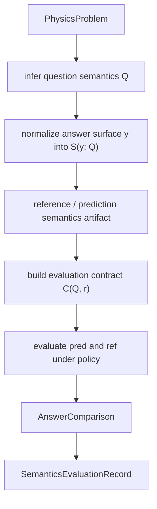

# Physics Semantics Protocol

`prkit_semantics` is the implementation of our physics semantics protocol for
evaluating final answers in physics reasoning tasks.

The protocol is motivated by a simple physics observation: a final answer is
not only a string. It is a physical object in an outcome space defined by the
question. That object may be a dimensional quantity, a scalar number, a
symbolic expression, a relation, a vector, a matrix, a piecewise field, a
multi-part answer, a sign or direction, a boolean outcome, a qualitative state,
or a multiple-choice label. Correctness depends on the question's unit policy,
target variable, symbolic mode, coordinate frame, sign convention, required
parts, and allowed answer kinds.

This package implements **PASEC-Base**.

PASEC means **Physics Answer Semantics Evaluation Contract**. The name reflects
the central idea: physics answer evaluation should be performed by first
constructing explicit semantics for the answer and then evaluating those
semantics under a question- and reference-conditioned contract.

The suffix **Base** means this is the current minimal, reproducible protocol
instance:

- final-answer semantics only, not proof verification
- a finite answer-kind and answer-structure schema
- deterministic normalization for common physics answer surfaces
- reference-assisted contract construction for evaluation
- policy-controlled bridges for limited cross-kind equivalence
- auditable outputs with validation status, bridge metadata, and diagnostics

`PASEC-Base` is intentionally not the final ontology endpoint. It is the
engineering-grounded base layer that lets us study whether making physics
semantics explicit improves LLM physics-answer evaluation.

## Research Motivation

Physics reasoning benchmarks often ask whether a model solved a problem, but
the scoring layer is usually much thinner than the physics. Exact string
matching misses equivalent answers such as `1000 m` and `1 km`, `v = IR` and
`IR` when the question asks for `v`, or two algebraically equivalent symbolic
forms. Pure numeric matching misses units, dimensions, and precision. Pure
symbolic matching misses physical quantities, qualitative outcomes, multi-part
answers, and question-specific constraints. LLM judging can help, but without a
stable answer schema it is difficult to audit what the judge accepted.

The physics semantics protocol fills this gap by turning final-answer
evaluation into a typed, contract-governed semantic comparison problem.

The central claim is:

> A physics answer should be evaluated as a structured physical object under
> the semantic constraints implied by the question, not as an isolated surface
> string.

This shifts evaluation from "does the text look similar?" to questions such as:

- Is the prediction the same kind of physical object as the reference?
- Does the answer have the required structure: scalar, vector, matrix,
  interval, piecewise, or multi-part?
- Are units required, optional because fixed by the question, forbidden, or not
  applicable?
- If the answer is symbolic, is the question asking for an expression, a
  relation, or either?
- If the prediction is a relation and the reference is an expression, is there a
  target variable that makes the reduction physically legitimate?
- If the answer is multi-part, should children be compared positionally,
  unordered, or by named part labels?
- If a result is approximate, does it satisfy the precision communicated by the
  reference answer?

## Formal View

PASEC-Base uses four explicit objects:

- `Q`: question semantics, the auxiliary interpretation state induced by the
  problem statement.
- `S(y; Q)`: answer semantics for a raw answer surface `y` under question
  semantics `Q`.
- `C(Q, r)`: an evaluation contract built from question semantics `Q` and the
  normalized reference answer `r`.
- `E(pred, ref | C, B)`: the final equivalence decision under contract `C` and
  bridge set `B`.

In words:

1. Infer what answer space the question admits.
2. Normalize the reference and prediction into structured answer semantics.
3. Build a contract from the reference semantics and question semantics.
4. Evaluate the prediction against the reference under that contract.



## Core Schema

The protocol is useful because the schema is explicit. The most important
objects are `PhysicsQuestionSemantics`, `PhysicsAnswerSemantics`,
`PhysicsEvaluationContract`, and `AnswerComparison`.

### Question Semantics

`PhysicsQuestionSemantics` describes the answer space admitted by a question.
Important fields:

| Field | Meaning |
| --- | --- |
| `target_variable` | Primary variable the problem asks for, such as `v`, `B`, `T`, or `Delta_U`. |
| `symbol_aliases` | Question-scoped alias groups, for example treating `r(t)` as `r`. |
| `allowed_object_kinds` | Atomic semantic answer kinds admitted by the question. |
| `allowed_structures` | Structural answer forms admitted by the question. |
| `question_symbolic_mode` | Whether symbolic answers should be expressions, relations, or either. |
| `question_unit_policy` | Whether units are required, optional, forbidden, or irrelevant. |
| `question_unit` | Fixed output unit when the problem says "in m/s", "in joules", etc. |
| `dimension` | Expected physical dimension, such as `length`, `energy`, `force`, or `acceleration`. |
| `ordering` | Whether structured children are ordered, unordered, or matched by part label. |
| `required_parts` | Named slots for multi-part answers, such as `magnitude` and `direction`. |
| `coordinate_frame` | Frame convention for vector, matrix, or tensor answers. |
| `sign_convention` | Sign convention for directional or signed quantities. |
| `tolerance` | Numeric tolerance used when exact equivalence is not available. |
| `choice_space` | Allowed labels for multiple-choice or bounded discrete answers. |

The main question-side enums are:

```text
QuestionSymbolicMode:
  expression, relation, either

QuestionUnitPolicy:
  required, optional_if_question_fixed_unit, forbidden, not_applicable

OrderingPolicy:
  ordered, unordered, per_part
```

There are two inference modes:

- `infer_reference_question_semantics(problem)` is answer-aware and may use
  gold-answer-derived signals. It is used to construct reference semantics.
- `infer_prediction_question_semantics(problem)` is answer-blind and removes
  gold-answer-derived metadata. It is safe to use before solving.

`infer_question_semantics(problem)` is the reference-oriented compatibility
helper.

### Answer Semantics

`PhysicsAnswerSemantics` is the normalized representation of a final answer.
Important fields:

| Field | Meaning |
| --- | --- |
| `canonical_text` | Stable text representation used by the protocol. |
| `object_kind` | Atomic semantic kind of the answer. |
| `structure` | Higher-level structure of the answer. |
| `canonical_latex` | Preserved or synthesized LaTeX surface when useful. |
| `raw_text` | Original answer surface. |
| `numeric_value`, `numeric_text` | Parsed numeric payload and precision-bearing text. |
| `unit` | Canonical unit string for physical quantities. |
| `dimension` | Physical dimension propagated from the question or answer. |
| `target_variable` | Variable bound to the answer when known. |
| `part_label` | Named slot for one child of a multi-part answer. |
| `shape` | Vector, matrix, or tensor shape metadata. |
| `interval_open_left`, `interval_open_right` | Endpoint openness for interval answers. |
| `children` | Recursive child semantics for tuple, set, vector, matrix, tensor, and multi-part answers. |
| `cases` | Piecewise branches with expression and condition semantics. |
| `subject_to` | Global side conditions, such as `x > 0` or `a < r < b`. |
| `choice_label` | Canonical multiple-choice label. |
| `boolean_value` | Boolean interpretation for truth-valued answers. |
| `sign_value` | Canonical sign or direction label. |
| `coordinate_frame`, `sign_convention` | Frame and sign metadata attached to the answer. |
| `quantity_view` | Deterministic source and canonical snapshots for physical quantities. |
| `diagnostics` | Non-fatal notes from normalization or repair. |

The answer object-kind enum is:

```text
AnswerObjectKind:
  number
  physical_quantity
  expression
  relation
  qualitative_label
  choice
  boolean
  sign_direction
  descriptive_text
```

The answer-structure enum is:

```text
AnswerStructure:
  atomic
  multi_part
  tuple
  set
  interval
  vector
  matrix
  tensor
  piecewise
```

The distinction between `object_kind` and `structure` is essential. A vector of
numbers is not merely a number with punctuation. A multi-part answer containing
`magnitude` and `direction` is not equivalent to a single relation unless the
contract explicitly admits that structure. A choice label is not a scalar
number, even if both surfaces are `1`.

### Evaluation Contract

`PhysicsEvaluationContract` is the evaluation-time contract. It is built from
question semantics and the reference answer semantics.

Important fields:

| Field | Meaning |
| --- | --- |
| `contract_version` | Version tag, currently `pasec-base-v1`. |
| `question_semantics` | The base question semantics. |
| `question_text`, `problem_type` | Problem metadata used by guarded heuristics. |
| `expected_object_kind` | Top-level object kind derived from the reference answer. |
| `expected_structure` | Top-level structure derived from the reference answer. |
| `target_variable` | Contract-time target variable. |
| `enabled_bridge_ids` | Named cross-kind bridges available to the evaluator. |
| `enabled_bridge_tiers` | Risk tiers enabled by the contract. |

Validation status is:

```text
ContractValidationStatus:
  admitted, coercible, violating
```

An admitted answer satisfies the contract directly. A coercible answer violates
the expected kind in a way that may be rescued by an enabled bridge. A violating
answer fails the contract and is rejected under the non-permissive policies.

### Comparison Result

`AnswerComparison` records the final decision and how it was reached:

| Field | Meaning |
| --- | --- |
| `equivalent` | Final boolean verdict. |
| `comparison_mode` | Matcher or bridge path that produced the verdict. |
| `diagnostics` | Human-readable mismatch or repair notes. |
| `validation_status` | Contract validation status used by the final path. |
| `bridge_id`, `bridge_tier` | Accepted bridge, when a cross-kind bridge was used. |
| `bridge_evidence` | Compact evidence explaining why the bridge was allowed. |
| `policy_mode` | Active comparison policy. |
| `surface_shortcut_used` | Whether same-kind canonical text equality decided the result. |

The policy enum is:

```text
ComparisonPolicyMode:
  strict, audited, permissive
```

Bridge tiers are:

```text
BridgeTier:
  tier1, tier2, tier3
```

Tier 1 bridges are mathematical or type-safe, such as extracting the requested
expression from a relation. Tier 2 bridges are contract-governed, such as
allowing a bare number when the question fixes the unit. Tier 3 bridges are
heuristic and disabled in the audited path unless explicitly enabled.

## What PASEC-Base Can Represent

PASEC-Base covers common final-answer forms in physics:

- scalar numbers, including exact fractions and approximate decimals
- physical quantities with units and dimensional canonicalization
- symbolic expressions and equations
- inequalities and chained relation constraints
- intervals, sets, tuples, vectors, matrices, tensors, and piecewise answers
- multi-part answers with named slots, such as `magnitude` and `direction`
- global side conditions using `subject_to`
- multiple-choice labels and bounded discrete outcomes
- booleans, signs, directions, and curated qualitative labels
- free-form descriptive ("explain/why") answers, judged by conservative normalized-text equality
- question-scoped symbol aliases and notation variants
- coordinate-frame and sign-convention metadata

The protocol deliberately keeps proof traces and chain-of-thought verification
out of scope. It evaluates the semantics of the final answer object.

## Happy Path: Deterministic Semantics

The smallest reproducible path is deterministic question inference, answer
normalization, contract construction, and evaluation.

```python
from prkit.core.domain import Answer, AnswerObjectKind, PhysicsProblem
from prkit.semantics import (
    ComparisonPolicyMode,
    build_evaluation_contract,
    compare_protocol_answers,
    infer_reference_question_semantics,
    normalize_physics_answer,
)

problem = PhysicsProblem(
    problem_id="demo-speed",
    question="Find the speed in m/s.",
    answer=Answer(value="18", unit="km/h", answer_kind=AnswerObjectKind.PHYSICAL_QUANTITY),
)

question_semantics = infer_reference_question_semantics(problem)
reference = normalize_physics_answer(problem.answer, context=question_semantics)
prediction = normalize_physics_answer("5", context=question_semantics)

contract = build_evaluation_contract(
    question_semantics=question_semantics,
    reference_answer_semantics=reference,
    problem=problem,
)

result = compare_protocol_answers(
    prediction,
    reference,
    contract=contract,
    context=question_semantics,
    policy_mode=ComparisonPolicyMode.AUDITED,
)

print(reference.canonical_text)      # "5 m/s"
print(prediction.canonical_text)     # "5"
print(result.equivalent)             # True
print(result.bridge_id)              # "quantity_to_number"
```

This passes because the question fixes the output unit, so the bare prediction
`5` can be interpreted as `5 m/s`. If the question required explicit units, the
same prediction would be rejected.

## Happy Path: Reference and Prediction Artifacts

For experiment runs, use the artifact layer. It records the problem snapshot,
question semantics, answer semantics, generator metadata, evaluation contract,
policy, and final result.

```python
from prkit.semantics import (
    create_reference_semantics,
    evaluate_saved_semantics,
    generate_prediction_semantics,
    save_semantics_json,
)

# create_reference_semantics is deterministic when model_client is omitted.
reference_artifact = create_reference_semantics(problem, model_client=reference_model_client)
prediction_artifact = generate_prediction_semantics(problem, solver_model_client)

save_semantics_json(reference_artifact, "reference/demo-speed.json")
save_semantics_json(prediction_artifact, "prediction/demo-speed.json")

record = evaluate_saved_semantics(
    "reference/demo-speed.json",
    "prediction/demo-speed.json",
)

print(record.comparison.equivalent)
print(record.comparison.comparison_mode)
print(record.comparison.diagnostics)
```

`evaluate_saved_semantics(...)` defaults to the audited policy.

## Examples of Physics Semantics

### Units and Dimensions

`1 km`, `1000 m`, and `10^5 cm` can be equivalent length quantities, but only
after unit parsing and dimensional normalization. PASEC-Base stores both source
and canonical quantity snapshots in `quantity_view` so that comparison can
respect source precision while comparing in a common unit space.

### Symbolic Forms

`v = IR` and `IR` are not generally the same object: one is a relation and one
is an expression. They can be equivalent when the question asks for `v` and the
contract enables relation-to-expression reduction. This prevents unsafe
cross-kind matching while admitting physically legitimate answer forms.

### Structure

`(1, 2)`, `{1, 2}`, `[1, 2)`, `<1, 2>`, and `[[1, 0], [0, 1]]` are different
answer structures. The protocol compares them with structure-specific rules:
ordered tuple comparison, unordered set comparison, endpoint-aware interval
comparison, shape-aware vector/matrix/tensor comparison, and recursive child
comparison.

### Multi-Part Answers

For questions such as "Determine the magnitude and direction of the force," the
answer space has named parts. A prediction like `F = qE, to the right` is
normalized as a `multi_part` answer with `magnitude` and `direction` children.
The `per_part` ordering policy compares children by slot label instead of
blindly comparing surface order.

### Side Conditions

An answer like `E(r) = k/r, a < r < b` is one relation with a side condition.
PASEC-Base stores the main answer in `canonical_text` and the constraint in
`subject_to`. Side conditions are compared order-insensitively as conjunctive
constraints.

## Evaluation Policies

PASEC-Base supports three policies:

- `strict`: contract violations fail, coercible answers fail, and bridges are
  disabled.
- `audited`: the default experimental path. Contract violations fail, admitted
  answers compare normally, and coercible answers may pass only through enabled
  Tier 1 or Tier 2 bridges.
- `permissive`: a debugging path that allows all implemented bridges.

Use `audited` for standard experiments. Use `strict` for ablations that measure
how much equivalence depends on bridges. Use `permissive` only for debugging,
migration, or error analysis.

## Recommended Experiment Reporting

Because PASEC-Base introduces a new evaluation object, effectiveness should be
shown through behavior, not by claiming there is an existing standard to beat.
Useful reporting axes include:

- agreement with expert-labeled final-answer equivalence
- false accepts and false rejects by answer kind and structure
- unit and dimension cases
- relation-expression cases with target variables
- vector, matrix, tensor, interval, set, multi-part, and piecewise cases
- side-condition handling
- reference-precision handling
- choice-label and numeric-surface collisions
- bridge usage counts by `bridge_id` and `bridge_tier`
- diagnostics distribution for rejected answers

Suggested ablations:

- exact text only
- text normalization only
- numeric tolerance only
- symbolic equivalence only
- unit-aware quantity matching only
- PASEC-Base `strict`
- PASEC-Base `audited`
- PASEC-Base `permissive`

The most important qualitative evidence is a set of paired examples: cases
where surface matching falsely rejects physically equivalent answers, and cases
where broad matching falsely accepts physically different answers.

## Engineering Notes

Important public entry points:

```python
from prkit.semantics import (
    infer_reference_question_semantics,
    infer_prediction_question_semantics,
    normalize_physics_answer,
    normalize_problem_answer,
    build_evaluation_contract,
    compare_protocol_answers,
    create_reference_semantics,
    generate_prediction_semantics,
    extract_prediction_answer_semantics,
    evaluate_saved_semantics,
)
```

Normalization is deterministic where possible. Inference helpers can call an LLM
to author or repair semantics, but provider outputs are validated against strict
Pydantic models and then converted back into the canonical public schema.

For prediction runs, prefer `infer_prediction_question_semantics(...)` or the
prediction artifact flow. This keeps the prediction side answer-blind.

For reference runs, use `infer_reference_question_semantics(...)` or the
reference artifact flow. This permits reference-side signals to define the
contract used for evaluation.

For physical quantities, inspect `quantity_view` when debugging. It records:

- `source`: the parsed source numeric text, value, and unit
- `canonical`: the canonical numeric text, value, and unit
- `diagnostics`: non-fatal quantity normalization notes

For rejected comparisons, inspect:

- `comparison_mode`
- `diagnostics`
- `validation_status`
- `bridge_id`
- `bridge_tier`
- `bridge_evidence`

These fields are intended to make evaluation decisions auditable rather than
opaque.

## Scope Boundaries

PASEC-Base currently covers final-answer semantics. It does not verify the
derivation, proof, physical assumptions, or chain of reasoning that produced the
answer. It also does not claim to be a complete ontology of physics quantities
or problem-solving states.

Known boundaries:

- `choice` remains an answer object kind in PASEC-Base, even though a future
  ontology may separate answer source format from physical outcome kind.
- Tier 3 bridges are implemented for analysis but are not part of the default
  audited path.
- Symbolic equivalence is limited by parser coverage and conservative aliasing.
- Unit support is broad enough for common benchmark physics answers, but it is
  not a complete units system.
- Coordinate frames and sign conventions are represented as metadata and are
  compared conservatively.

These boundaries are deliberate. The goal of PASEC-Base is to provide a stable
base protocol for experiments, error analysis, and future extensions.
