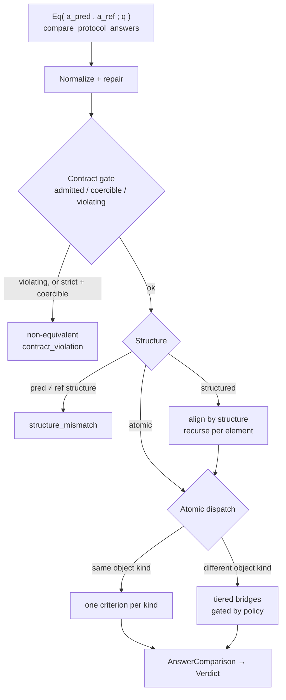
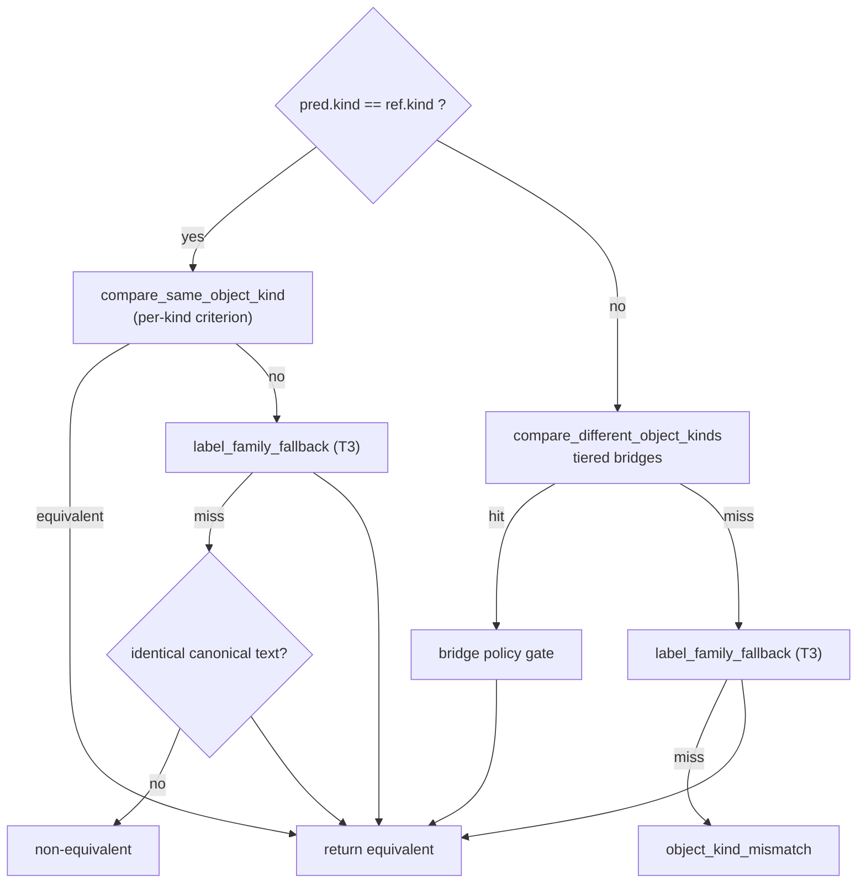
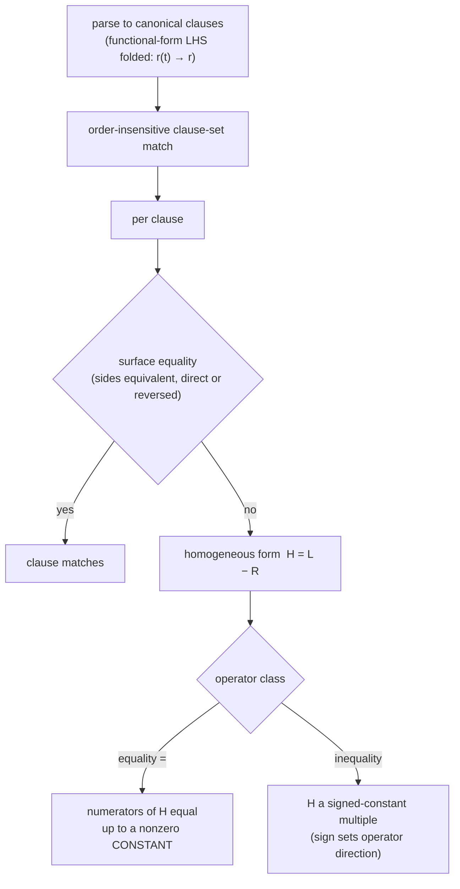

# Physics-semantics equivalence judgement — detailed reference

How `compare_protocol_answers` decides whether two physics answers express the same
physical meaning. This is the **reference** for the judgement; the precision-preserving
**design discipline** for changing it lives in [`METHODOLOGY.md`](METHODOLOGY.md).

Every example below is a real engine result. Notation: `pred ≡ ref` means equivalent,
`pred ≢ ref` means not, and `→ mode` is the resulting `comparison_mode`.

- Entry point: `compare_protocol_answers(pred, ref, *, contract=None, context=None, policy_mode=None)` — [engine.py:39](engine.py)
- It is the deterministic equivalence relation `Eq(a_pred, a_ref ; q)` of the physics-semantics framework: a typed, question-conditioned judgement, not string overlap.

---

## 1. Inputs: the answer-semantics record

Each side is an `PhysicsAnswerSemantics` record (raw strings are coerced into one):

- **`object_kind`** — one of 8 atomic kinds (`AnswerObjectKind`): `number`,
  `physical_quantity`, `expression`, `relation`, `qualitative_label`, `choice`,
  `boolean`, `sign_direction`.
- **`structure`** — one of 9 (`AnswerStructure`): `atomic`, `multi_part`, `tuple`,
  `set`, `interval`, `vector`, `matrix`, `tensor`, `piecewise`.
- **`canonical_text`** + typed fields (`numeric_value`, `numeric_text`, `unit`,
  `choice_label`, `boolean_value`, `sign_value`, `children`, `cases`, …).

The **question semantics** `q` (`PhysicsQuestionSemantics`, passed as `context`) supply
the conditioning: `target_variable`, `symbol_aliases`, unit/sign policy, ordering policy,
and the numeric `tolerance`. The judgement is *under* `q` — e.g. a required unit lets a
bare `5` be read as `5 m/s²`.

---

## 2. Pipeline overview



The four gates run before any kind-specific logic. Sections 3–6 walk them; section 7 is
the heart (per-kind criteria); sections 8–9 cover bridges and policy.

---

## 3. Stage 1 — normalize & repair

`coerce_protocol_answer` builds a typed record from a dict/string; then
`_repair_answer_for_comparison` re-parses ambiguous symbolic surfaces and re-hydrates
structured answers. The most common repair: a prediction stored as `expression` whose
text is really a relation (`d = sqrt(P L)`) is reclassified to `relation` so the right
criterion applies.

This stage also applies the **symbolic canonicalizations** that make later comparison
stable (all in `preprocess_symbolic_text` / `parse_relation_clauses`):

| Canonicalization | Effect | Code |
|---|---|---|
| LaTeX → ASCII math | `\frac{a}{b}`, `\sqrt{x}`, Greek, accents, subscripts | `_replace_simple_latex`, `_normalize_latex_*` |
| Question-scoped symbol aliases | `q.symbol_aliases` rewrite (`r(t)→r`) | `_canonicalize_symbol_alias_surfaces` |
| Functional-form relation LHS | `r(t) = … → r = …` (relations only) | `_collapse_functional_form_lhs` |
| Big-operator limits | fold `\sum_{n=1}^{N}` so its `=` can't corrupt parsing | `_normalize_big_operator_bounds` |
| Compact products | `NmV_r → N*m*V_r` | `_normalize_symbol_products` |

---

## 4. Stage 2 — contract gate & policy

A `PhysicsEvaluationContract` is derived from the reference answer + `q` (expected kind,
structure, target variable, unit policy, symbolic mode, choice space, ordering, enabled
bridges). Each side is classified by `validate_answer_against_contract`
([contract.py:69](contract.py)):

- **admitted** — satisfies the expected kind and question-side policies directly.
- **coercible** — differs in a limited, possibly-meaningful way.
- **violating** — fails the contract.

The three **policy modes** (`ComparisonPolicyMode`) control how strict this is and which
bridges may fire:

| Policy | Contract validation | Coercible pred | Cross-kind bridges |
|---|---|---|---|
| `strict` | enforced | rejected (`contract_violation`) | **none** |
| `audited` | enforced | allowed | only bridge tiers in `contract.enabled_bridge_tiers`, precondition must hold |
| `permissive` | skipped | allowed | **all** |

A violating reference short-circuits to `reference_contract_violation`; a violating
prediction to `contract_violation`. (See §9 for a worked policy example.)

---

## 5. Stage 3 — structure routing

If the two structures differ → `structure_mismatch`. Otherwise atomic goes to §6; every
structured form aligns by its structure and **recurses into `compare_protocol_answers`
per element**, ultimately reducing to atomic comparisons.

| Structure | Routing | Example |
|---|---|---|
| `atomic` | §6 atomic dispatch | — |
| `multi_part` | ordered / unordered / per-part by `q.ordering` | — |
| `tuple` | positional | `(1, 2) ≡ (1, 2)` → `tuple` |
| `set` | order-insensitive | `{1, 2} ≡ {2, 1}` → `set` |
| `interval` | endpoint + boundary check | — |
| `vector` / `matrix` / `tensor` | shape + per-cell | — |
| `piecewise` | align cases + conditions | — |

`1 ≢ (1)` → `structure_mismatch` (atomic vs tuple).

---

## 6. Stage 4 — atomic dispatch



`_compare_atomic` ([engine.py:314](engine.py)): same kind → the §7 criterion; on a miss,
a Tier-3 label-family fallback and an identical-text check. Different kind → the §8
bridges, then the label-family fallback, else `object_kind_mismatch`.

---

## 7. Same object kind — one criterion per kind

`compare_same_object_kind` ([same_object_kind.py:33](same_object_kind.py)) dispatches on
`object_kind`. Each kind has a **canonical form** and **one decision criterion**.

### 7.1 `number`

Parse the scalar; accept on relative closeness within `q.tolerance`, else on a
**reference-precision** match (see §10). The reference defines the required precision, so
the relation is asymmetric in pred vs ref.

```
0.5      ≡ 1/2     → number      (exact)
0.5      ≢ 0.7     → number      (outside tolerance)
9.8      ≡ 9.81    → number      (pred less precise; consistent with the reference)
9.81     ≢ 9.8     → number      (pred MORE precise than a coarser reference)
0.333    ≡ 1/3     → number      (ref is an exact non-terminating rational)
1/3      ≢ 0.333   → number      (reference fixes 3 decimals; 1/3 is not that number)
```

### 7.2 `physical_quantity`

Canonical form is `(coefficient, symbolic factor, unit)`. Convert the prediction's unit
to the reference unit (`unit_conversion_factor`), require the **symbolic factor** to
match, then apply the §10 numeric criterion to the coefficients. Dimensionally
incompatible units fail.

```
5 m/s     ≡ 18 km/h   → physical_quantity   (unit conversion)
100 cm    ≡ 1 m       → physical_quantity
9.8 m/s^2 ≡ 9.8 m/s²  → physical_quantity   (unicode / suffix unit normalization)
3 m/s     ≢ 3 m       → physical_quantity   (dimension mismatch)
```

### 7.3 `expression`

Parse both to SymPy; equivalent iff `simplify(a − b) == 0` (with `trigsimp` and a
numeric-`N` fallback). A prediction written as `x = …` is reduced to its solved side
before comparison (`_prediction_rhs_matches_expression`).

```
v t                       ≡ t v                       → expression
sqrt(lambda P L/(L+P))    ≡ sqrt(lambda L P/(L+P))    → expression
x^2                       ≢ x^3                        → expression
```

### 7.4 `relation` — the algebraic core

A relation is parsed into a **canonical clause set** and matched order-insensitively
(`relations_equivalent`). Per clause, two layered criteria
(`_relation_clause_equivalent`):



**Equality criterion** (`_equalities_equivalent`) — clear denominators from `H = L − R`
and require the numerators equal up to a nonzero *constant*. This admits rearrangement
across `=` and rejects equations with extra roots:

```
F = m a            ≡ a = F/m            → relation   (solve for another variable)
E = m c^2          ≡ m = E/c^2          → relation
1/f = 1/u + 1/v    ≡ f = (u v)/(u + v)  → relation   (clear fractions)
v = a t            ≡ v = t a            → relation   (commutative RHS)
F = m a            ≡ m a = F            → relation   (reversed sides)
r(t) = a x         ≡ r = a x            → relation   (functional-form LHS)
x = 0              ≢ x*y = 0            → relation   (factor y enlarges the root set)
x = 1              ≢ x^2 = 1            → relation   (extra root x = -1)
F = m a            ≢ F = m/a            → relation
```

**Inequality criterion** (`_inequalities_equivalent`) — the homogeneous forms must be a
signed-*constant* multiple, sign-consistent with the operator directions. Denominators
are **not** cleared (an unknown-sign denominator could flip the inequality), so
rearrangement that needs division is *not* applied:

```
2 <= k < 3   ≡ k >= 2 and k < 3   → relation   (chained / conjunction, order-insensitive)
F < m a      ≢ a < F/m            → relation   (would need ÷m; sign unknown → not merged)
```

Two parser canonicalizations keep relations robust:

```
V = sum_{n=1}^{N} (m V_r)/(M + n m)  ≡  V = \sum_{n=1}^{N} \frac{m V_r}{M + n m}  → relation
V = NmV_r/(M + Nm)                   ≡  V = N m V_r/(M + N m)                     → relation
```

### 7.5 categorical kinds — `choice`, `boolean`, `sign_direction`, `qualitative_label`

Canonicalize to a controlled label, then compare for equality (qualitative also matches
on a shared alias-group candidate).

```
B           ≡ (B)        → choice            (uppercase token)
yes         ≡ true       → boolean
clockwise   ≡ clockwise  → sign_direction
increases   ≡ goes up    → qualitative_label (alias group)
```

---

## 8. Different object kind — tiered bridges

When kinds differ, `compare_different_object_kinds`
([different_object_kind.py:47](different_object_kind.py)) tries a coercion bridge. Each
bridge carries a **risk tier**; the tier and policy decide whether it is allowed (§9).

| Tier | Bridge (`comparison_mode`) | Coercion | Example |
|---|---|---|---|
| **T1** | `relation_to_expression` | project `target = …` to its solved side | `v = a + b` ≡ `a + b` (target `v`) |
| **T1** | `relation_rhs` | relation vs number/quantity via the relation's RHS | `E = 5` ≡ `5` |
| **T1** | `expression_to_number` | evaluate an expression to a number | `2 + 3` ≡ `5` |
| **T2** | `quantity_to_number` | quantity vs number when `q` fixes the unit | `5` ≡ `5 m/s²` (unit from `q`) |
| **T2** | `expression_quantity` | expression vs physical quantity | — |
| **T2** | `choice`, `terminal_polarity_choice`, `terminal_polarity` | choice ↔ label ↔ sign | — |
| **T3** | `relation_to_qualitative_label` | relation vs a qualitative outcome | — |
| **T3** | `qualitative_zero` | "no change" ↔ a zero value | `0` ≡ `no change` |
| **T3** | `label_family_fallback` | last-resort same-/cross-kind label family | — |

A bridged result records `bridge_id` and `bridge_tier` on the `AnswerComparison`. If no
bridge fires → `object_kind_mismatch` (e.g. `5` vs choice `B`).

---

## 9. Policy in action

The same coercible pair behaves differently by policy (`_apply_bridge_policy` →
`bridge_enabled_for_policy`). Number `0` vs qualitative `no change` (a Tier-3 bridge):

```
strict      → 0  ≢  no change   → contract_violation   (no bridges; coercible rejected)
audited     → 0  ≢  no change   → bridge_blocked        (T3 not in enabled tiers)
permissive  → 0  ≡  no change   → qualitative_zero      (bridge fires)
```

So: `strict` is the same-kind criteria only; `audited` admits exactly the bridge tiers a
contract opts into; `permissive` is the most lenient (and the legacy default).

---

## 10. Numeric tolerance & reference precision

`numbers_match_with_reference_precision` ([semantics.py](semantics.py)) decides numeric
agreement in order:

1. **Relative closeness** — `numbers_close(pred, ref, tolerance)` (`q.tolerance`,
   relative; handles NaN/inf and sign).
2. **Significant figures** — if the prediction has at least the reference's significant
   figures, round both to the reference's sig-figs and require a match whose raw
   difference sits strictly inside the rounding interval (half-quantum).
3. **Decimal places** — analogous fallback for fixed-point literals.
4. **Exact non-terminating reference** — if the reference is an exact rational like `1/3`,
   accept a prediction that matches at the prediction's own stated precision.

The reference sets the bar, so the relation is asymmetric (see the `9.8`/`9.81` and
`0.333`/`1/3` pairs in §7.1). For the exact half-quantum boundary, read
`_difference_is_strictly_within_half_quantum`.

---

## 11. `comparison_mode` catalogue

The `AnswerComparison.comparison_mode` names the path taken:

- **Same-kind criteria:** `number`, `physical_quantity`, `expression`, `relation`,
  `choice`, `boolean`, `sign_direction`, `qualitative_label`.
- **Cross-kind bridges:** `relation_to_expression`, `relation_rhs`,
  `expression_to_number`, `quantity_to_number`, `expression_quantity`, `choice`,
  `terminal_polarity`, `terminal_polarity_choice`, `relation_to_qualitative_label`,
  `qualitative_zero`, `label_family_fallback`.
- **Structured:** `tuple`, `set`, `multi_part`, `interval`, `vector`/`matrix`/`tensor`,
  `piecewise`.
- **Non-equivalent / control:** `structure_mismatch`, `object_kind_mismatch`,
  `contract_violation`, `reference_contract_violation`, `bridge_blocked`,
  `unsupported_structure`, `unsupported_object_kind`.

---

## 12. Output → `Verdict`

The engine returns an `AnswerComparison` (`equivalent`, `comparison_mode`, `diagnostics`,
`validation_status`, `bridge_id`/`bridge_tier`, `policy_mode`). `scoring/_adapt.py` maps
it losslessly into the public `Verdict`:

| Verdict field | Source |
|---|---|
| `correct` / `equivalent` | `AnswerComparison.equivalent` |
| `score` | `1.0` / `0.0` (graded scorers fill `partial_credit`) |
| `comparison_mode` | passthrough |
| `symbolic_equiv` | `equivalent` for symbolic modes (`expression`, `relation`, …) |
| `units_ok`, `numeric_within_tol` | derived for numeric modes |
| `diagnostics`, `scorer_version` | passthrough / version stamp |

`prkit.verify.verify(pred, ref)` is the light-import facade over this whole pipeline.

---

## 13. End-to-end traces

- `verify("F = m a", "a = F/m")` → normalize → both `relation`, `atomic` → same-kind
  relation criterion → clause `F = m a` vs `a = F/m`: surface no; homogeneous numerators
  `F − m a` and `a m − F` differ by `−1` → **equivalent**, mode `relation`,
  `symbolic_equiv = True`.
- `verify("5 m/s", "18 km/h")` → both `physical_quantity` → convert `18 km/h = 5 m/s`,
  symbolic factor `1` matches, coefficients close → **equivalent**, mode
  `physical_quantity`, `units_ok = True`.
- number `0` vs qualitative `no change` under `audited` → kinds differ → `qualitative_zero`
  is Tier-3 → not in enabled tiers → **bridge_blocked**, not equivalent.

---

## 14. Where to look

- Dispatch & gates: [engine.py](engine.py); contract: [contract.py](contract.py).
- Same-kind criteria: [same_object_kind.py](same_object_kind.py),
  [numeric.py](numeric.py), [semantics.py](semantics.py).
- Bridges & tiers: [different_object_kind.py](different_object_kind.py),
  [bridge_registry.py](bridge_registry.py).
- Verdict mapping: [`../../scoring/_adapt.py`](../../scoring/_adapt.py).
- Design discipline for changes: [METHODOLOGY.md](METHODOLOGY.md).
- Tests (every example here has a counterpart):
  [`tests/prkit/semantics/test_protocol_comparison.py`](../../../../tests/prkit/semantics/test_protocol_comparison.py),
  [`tests/prkit/verify/test_verify.py`](../../../../tests/prkit/verify/test_verify.py).
